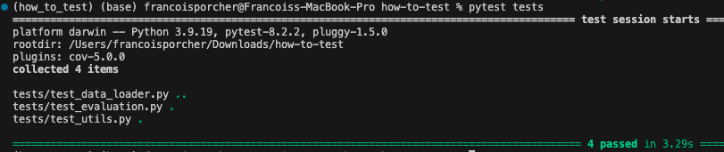
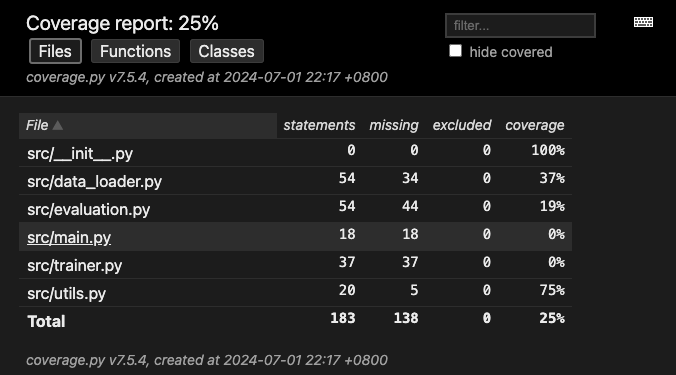

# How to properly test a Machine Learning Project?

## Project overview

Everyone knows that testing is a key component of software development. But what about testing in machine learning projects? Testing is just as important in machine learning as it is in software development, but very often neglected. This is not something we learn at school.

This projects aims to be an introduction on how to test different parts of a machine learning project. We will be fine-tuning BERT for text classification on the IMDb dataset, and test different parts of the pipeline using standard libraries: `pytest`, `pytest-cov`.

## Environment setup

To setup the environment, you can run the following command:

```bash
conda env create -f environment.yml
```

To activate the environment, you can run the following command:

```bash
conda activate how_to_test
```

## Project Structure


The project has the following structure, mainly composed of the `src` and `tests` directories.

- `src`: Contains the source code of the project.
- `tests`: Contains the tests of the project.

```
bert-text-classification/
├── src/
│   ├── data_loader.py
│   ├── evaluation.py
│   ├── main.py
│   ├── trainer.py
│   └── utils.py
├── tests/
│   ├── conftest.py
│   ├── test_data_loader.py
│   ├── test_evaluation.py
│   ├── test_main.py
│   ├── test_trainer.py
│   └── test_utils.py
├── models/
│   └── imdb_bert_finetuned.pth
├── environment.yml
├── requirements.txt
├── README.md
└── setup.py
```

## Pre-requisites

To run the project you will need a model in `models/imdb_bert_finetuned.pth`. I provide a script to fine-tune BERT on the IMDb dataset, but if you want to skip this step you could take the non fine-tuned model from the Hugging Face model hub.

To fine-tune BERT, run:

```bash
python src/main.py
```

To evaluate a model, you can run the following command:

```bash
python src/model_evaluation.py --model_path /Users/francoisporcher/Downloads/how-to-test/models/imdb_bert_finetuned.pth
```

# Testing

## Test your code using pytest.py

`pytest` is a standard and mature testing framework in the industry that makes it easy to write simple tests. 

You can test with several levels of granularity. You can test at several levels of granularity:

```bash
- Test a single function
- Test a script
- Test the entire project
```

### Introduction to conftest.py and fixtures

In pytest, a fixture is a function that returns a value. It is used when you need to repeat the same code in multiple tests.

For example, the tokenizer we use is the same in all tests. Instead of redefine it in each test, we can define it once in a fixture.

```python
@pytest.fixture(scope="module")
def bert_tokenizer():
    """Fixture to initialize the BERT tokenizer."""
    return BertTokenizer.from_pretrained("bert-base-uncased")
```

All the fixtures are defined in a file called `conftest.py`, located in the `tests` directory.


### Testing single functions with pytest.py

In the `data_loader.py` file, we use a very simple function that cleans the text by converting it to lowercase and stripping whitespace.

```python
def clean_text(text: str) -> str:
    return text.lower().strip()
```
In the `test_data_loader.py` file, we test this function by defining `test_clean_text`:

```python
def test_clean_text():
    """
    Test the clean_text function to ensure it correctly cleans the text.
    """
    assert clean_text("Hello, World!") == "hello, world!", "Failed to clean basic text."
    assert clean_text("  Spaces  ") == "spaces", "Failed to trim and lowercase text."
    assert clean_text("") == "", "Failed to handle empty string."
```

There are plenty of functions defined in the `test_data_loader.py` file, but if you want to run only the `test_clean_text` function, you can use the following command:

```bash
pytest tests/test_data_loader.py::test_clean_text
```


### Testing a script with pytest.py

We have tested a single function in the previous section. Now, let's test the whole script:

```bash
pytest tests/test_data_loader.py
```


### Running all tests with pytest.py

Now let's say you want to run all the tests in the `tests` directory:

```bash
pytest tests/
```

If all your tests pass, you will get the following output:



## 2. Measuring Test coverage with pytest-cov.py

In the previous section we have learned how to test code. In large projects, it is important to measure the `coverage` of your tests. In other words, how much of your code is tested.

`pytest-cov` is a plugin for `pytest` that generates test coverage reports. It is a great way to measure the quality of your tests.

That being said, do not get fooled by the coverage percentage. It is not because you have 100% coverage that your code is bug-free. It is just a way to measure the quality of your tests.

You can run the following command to generate a coverage report:

```bash
pytest --cov=src --cov-report=html tests/
```

You will get something like this:




