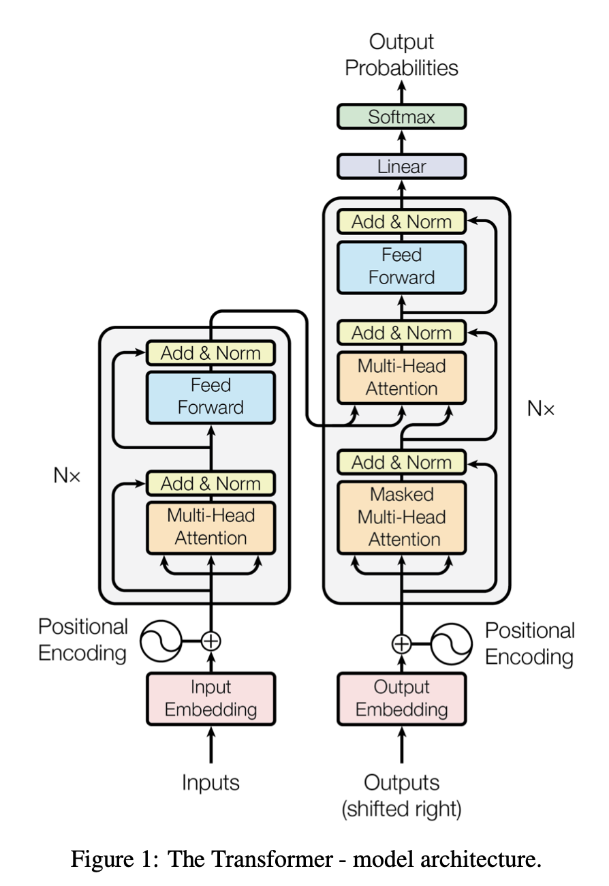

# Transformers from Scratch

This Github repository is my implementation of the Transformer architecture, with explanations on my Medium post.



# Instructions

First install the conda environment with
    
```bash
conda env create -f environment.yml
```
And activate it with

```bash
conda activate annotated_transformers
```
Then run the python script `transformers_from_scratch.py` with

```bash
python transformers_from_scratch.py
```


# Citations

- [Attention is All You Need](https://arxiv.org/abs/1706.03762)

- [The Annotated transformer](https://nlp.seas.harvard.edu/annotated-transformer/)
